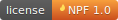

# NPF (No Perdak Fire) License

[](./LICENSE_EN)

A maximally permissive software license (based on MIT) with one extra
condition: rights are granted only to people whose *perdak* (also known as *pukan*)
does not catch fire frequently and without reason.

> This is a semi-parody license. The permissive core comes from MIT; the
> "No Perdak Fire" condition intentionally loosens that permissiveness at
> the licensor's discretion. For projects that need strict legal certainty,
> treat NPF as a joke overlay rather than your only license.

## Files

| File          | Purpose                                             |
|---------------|-----------------------------------------------------|
| `LICENSE_EN`  | Canonical, legally governing text (English)         |
| `LICENSE_RU`  | Informational Russian translation                   |
| `badges/npf-badge.svg` | Self-hosted badge for READMEs              |

## Use it in your project

1. Copy `LICENSE_EN` (and optionally `LICENSE_RU`) into your repo.
2. Fill in `[COPYRIGHT HOLDER]` / `[ПРАВООБЛАДАТЕЛЬ]` and the [YEAR].
3. Add the badge to your README (see below).
4. Optionally add this line to the top of each source file:
   ```
   // SPDX-License-Identifier: LicenseRef-NPF-1.0
   ```

## Badge

**Option A — shields.io (no hosting):**
```markdown
[](LICENSE_EN)
```

**Option B — self-hosted SVG from this repo:**
```markdown
[](https://github.com/nikolaynnov/npf-license/blob/master/LICENSE_EN)
```

**Option B (via jsDelivr CDN, most reliable content-type):**
```markdown
[](https://github.com/nikolaynnov/npf-license/blob/master/LICENSE_EN)
```
